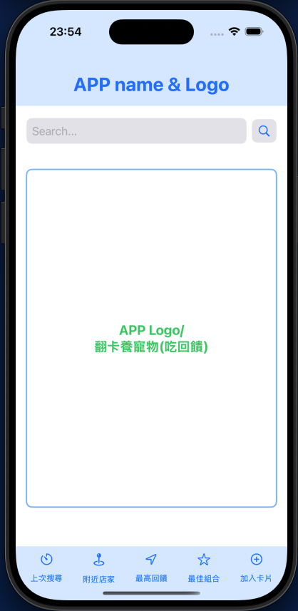

# Card App

This is a SwiftUI-based application that displays a simple user interface with a search bar, a central area for the app logo, and a tab bar with navigation links to different views.

## File Structure

- `Pending`

## ContentView.swift

This file contains the main view of the application, which includes:

- A header with the app name and logo.
- A search bar with a magnifying glass icon.
- A large central area for displaying the app logo and some text.
- A tab bar with navigation links to different views.

### Main Components

1. **Header**
    - Displays the app name and logo.
    - Uses a `ZStack` with a background color and a `Text` view.

2. **Search Bar**
    - Consists of a `TextField` for input and a `Button` with a magnifying glass icon.
    - Both elements are styled with padding, background color, and corner radius.

3. **Central Area**
    - A `RoundedRectangle` with a stroke and an overlay `Text` view.
    - Displays the app logo and some text.

4. **Tab Bar**
    - Contains `NavigationLink` elements for navigating to different views.
    - Each link has an icon and a label.

### Navigation Links

- **LastSearchView**: Displays the "上次搜尋頁面" text.
- **NearbyStoresView**: Displays the "附近店家頁面" text.
- **HighestRewardView**: Displays the "最高回饋頁面" text.
- **BestCombinationView**: Displays the "最佳組合頁面" text.
- **AddCardView**: Displays the "加入卡片頁面" text.

### Preview

The `ContentView_Previews` struct provides a preview of the `ContentView` for SwiftUI's preview canvas.

## How to Run

1. Open the project in Xcode.
2. Ensure you have the latest version of Xcode and Swift.
3. Build and run the project on the simulator or a physical device.

## License

This project is licensed under the MIT License.
